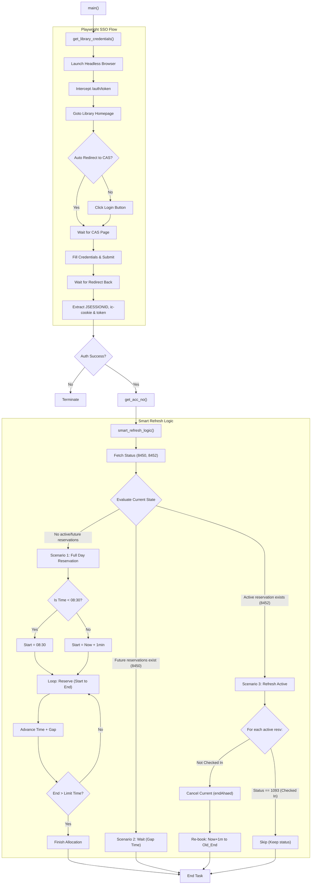

# 图书馆自动预约与状态刷新脚本

这是一个图书馆预约系统的自动化 Python 脚本。支持一键分段预约全天座位；智能识别当前状态，在不干扰已签到座位的前提下，通过“断开重连”逻辑刷新预约状态。

## 🌟 核心功能

*   **全自动登录**：基于 Playwright 模拟真人登录 CAS 统一认证系统，自动抓取 `JSESSIONID`、`ic-cookie` 和 `token`。
*   **智能时区处理**：强制锁定北京时间 (UTC+8)，无论服务器在何处（如 GitHub Actions 的海外服务器），时间计算均准确无误。
*   **分段预约逻辑**：支持单次最高 4 小时预约，段与段之间自动预留 10 分钟容错间隔（Gap）。
*   **状态刷新 (Keep-alive)**：针对已开始但未签到的预约，执行“提前结束并立即续约”，防止因未签到导致的违规或失效。
*   **签到保护**：检测到 `resvStatus: 1093` (已签到) 时，自动跳过刷新逻辑，确保座位安全。

## 🛠️ 核心逻辑说明

脚本根据图书馆系统的实时返回，自动切换以下三种场景：

| 场景 | 触发条件 | 执行动作 |
| :--- | :--- | :--- |
| **场景 1: 冷启动** | 无任何进行中或未来的预约 | 从 `max(现在, 08:30)` 开始，按 4 小时一段向后铺满预约，直到 21:45。 |
| **场景 2: 静默期** | 当前无预约，但未来有预约 | 判定为处于 10 分钟 Gap 时间或等待下一次预约开始，脚本**保持静默**。 |
| **场景 3: 刷新期** | 存在进行中的预约 | 若**未签到**，则记录原结束时间，执行“提前结束”并立即重新预约到原定时间点。若**已签到**，则跳过。 |

## ⚙️ 环境变量配置

为了安全起见，所有敏感信息均通过环境变量读取：

| 变量名 | 说明           | 示例                    |
| :--- |:-------------|:----------------------|
| `LIB_USER` | 统一认证学号 (必填)  | `32206300066`         |
| `LIB_PASS` | 统一认证密码 (必填)  | `your_password`       |
| `LIB_SEAT_ID` | 目标座位 ID (必填) | `101267800`           |
| `MOCK_NOW` | 模拟当前时间 (调试用) | `2026-03-12 08:00:00` |

## 🚀 快速开始

### 1. 本地运行
```bash
# 安装依赖
pip install requests playwright
python -m playwright install chromium
```

### 2. GitHub Actions 部署
1.  新建一个 **public** 仓库并上传代码。
2.  进入仓库 **Settings -> Secrets and variables -> Actions**。
3.  添加 `LIB_USER` 和 `LIB_PASS` 到 **Repository secrets**。
4.  脚本支持两种触发方式：
    *   **手动触发**：在 Actions 页面手动点击 `Run workflow`。
    *   **远程触发**：通过阿里云函数计算 (FC) 发送 `repository_dispatch` 事件（类型为 `fc-timer-trigger`）进行高精度定时调度。

## 全过程生命周期



## ⚠️ 免责声明
本脚本仅供学习交流使用，请遵守图书馆相关管理规定。


